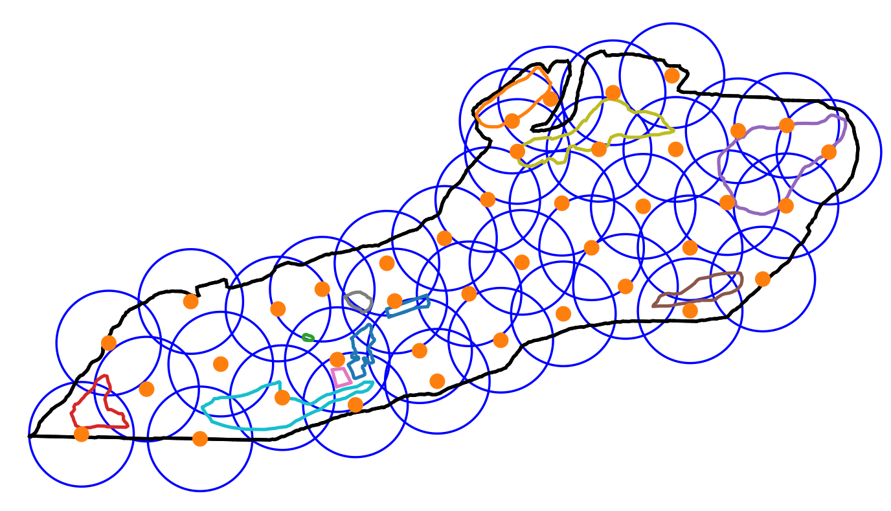
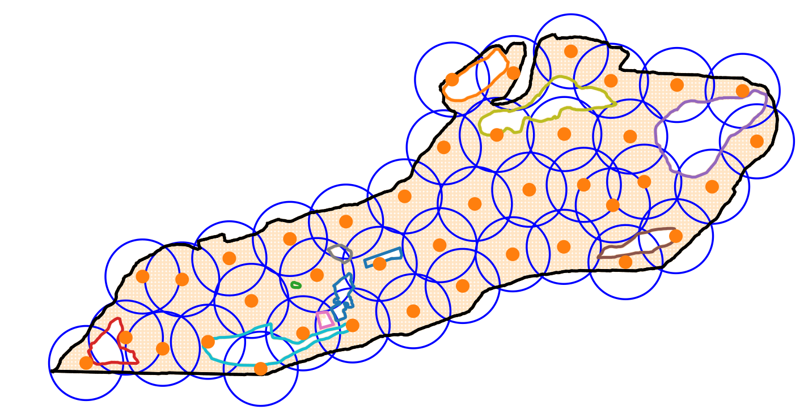

# p-center-problem

## Changes to the original repo https://github.com/profyliu/p-center-problem 

Adds a generic continuous optimization approach applying the https://github.com/dietmarwo/fast-cma-es library.
See https://github.com/dietmarwo/p-center-problem/blob/master/optimize.py .

@author: Dietmar Wolz (of the added code). 

Idea is:

 - Use all vertices of the outer polygon and from all holes as demand points.
 - Add a grid of about 10000 demand points filtered according to feasibility: Inside the outer polygon, outside the holes. 
 - Uses matplotlib.path.contains_points to determine if a point is valid.
 - Uses https://numba.pydata.org/[numba] to speed up the fitness calculation. 
 - Utilizes modern many-core CPUs, tested on the AMD 5950x 16 core CPU. 
 
See also https://github.com/dietmarwo/fast-cma-es/blob/master/tutorials/5G.adoc[5G tutorial] for a detailed description of the new method.   

Compare with 'python vorheur.py -p 20 -o belle_outer -i belle_botany2,belle_dock,belle_pavillion1,belle_pond1,belle_pond3,belle_pond5,belle_botany,belle_playground,belle_pond2,belle_pond4,belle_tennis_court'
 
Using
 
    max_evaluations = 200000
    opt = Bite_cpp(max_evaluations, popsize=500)
 
computation needs about 205 seconds, result is radius = 7.146 (see https://github.com/dietmarwo/p-center-problem/blob/master/fcmaes_nd.p20.pdf)
compared to radius = 8.667 for vorheur.py (see https://github.com/dietmarwo/p-center-problem/blob/master/vorheur_sol.p20.pdf), this is > 21% difference. 

Using     

    max_evaluations = 50000
    opt = Bite_cpp(max_evaluations)

computation takes 52 seconds resulting in radius = 7.57.

For p=40 the difference grows: vorheur.py achieves radius = 6.312 compared to radius = 5.117 for fcmaes, more than 23% more, where fcmaes took 942 seconds .
If we look at the results we see that vorheur.py covers all holes, where fcmaes uses the fact that these don't need to be covered.

- vorheur.py result for p=40

- optimize.py result for p=40 showing the demand point grid

Note that the comparison is not completely fair: Since a demand point grid is used there can be minor "coverage holes" when there is no demand point in this area. But since the used grid has a configured spacing of 0.5, increasing the radius by at most 0.25 fills all "coverage holes". 

## Original readme

The stand-alone program vorheur.py solves the p-center area coverage problem. 

Usage Examples:

    python vorheur.py -h
    
    python vorheur.py -p 3 -o belle_outer
    
    python vorheur.py -p 3 -o belle_outer -i belle_pond1,belle_pond2,belle_pond3
    
Description: 

Run the Voronoi heuristic to cover a polygon with p circles such that no circle’s center lies outside the polygon, no circle’s center drops inside a polygonal hole, and the radius of the largest circle is as small as possible.
The outer polygon and hole files must be .kml files (e.g., generated by Google Earth). 

Citation: 

Yanchao Liu (2021). "A faster algorithm for the constrained minimum covering circle problem to expedite solving p-center problems in an irregularly shaped area with holes", Naval Research Logistics, in print. 

######### Below is the older version ###########

The program vorheur_rev1.py solves the p-center area coverage problem. The area to be covered must be a polygon defined in a KML file. The input can 
also contain 0, 1 or multiple holes, each being a polygon defined in a separate KML file. 
All input KML files should be in the same path as this program file. 
Through command line arguments, users can try different number of depots (centers) and using different CMCC methods. 

Usage: python vorheur_rev1.py ndepots method read_init_point

Required command line arguments: 

    - ndepots: an integer indicating the number of centers to use
    
    - method: a string (without quote marks), can be Wei, Wei_v2, Liu or Liu2021a
    
    - read_init_point: 0 or 1, 1 means read the pre-sampled starting center points (for reproducibility in paper); 0 means randomly sample starting points
    
Example: python vorheur_rev1.py 5 Liu2021a 1

The outer polygon and hole files must be .kml files (e.g., generated by Google Earth). 
The file names are hardcoded in the string array below. Users can customize them.

Key References: 

    1. Hu Wei, Alan T. Murray, and Ningchuan Xiao. Solving the continuous space p-centre problem: planning application issues. IMA Journal of Management Mathematics, 17(4): 413 - 425, 10 2006.
    
    2. Emo Welzl. Smallest enclosing disks (balls and ellipsoids). In Hermann Maurer, editor, New Results and New Trends in Computer Science, pages 359{370, Berlin, Heidelberg, 1991. Springer Berlin Heidelberg.
    
    3. Atsuo Suzuki and Zvi Drezner. The p-center location problem in an area. Location Science, 4(1):69 - 82, 1996.
    
    4. Nimrod Megiddo. Linear-time algorithms for linear programming in r3 and related problems. SIAM Journal on Computing, 12(4):759-776, 1983. doi: 10.1137/0212052.                                                                                           
    
    5. A working paper by Yanchao Liu, titled "A faster algorithm for the constrained minimum covering circle problem to expedite solving p-center problems in irregularly shaped area with holes"

@author: Yanchao Liu
